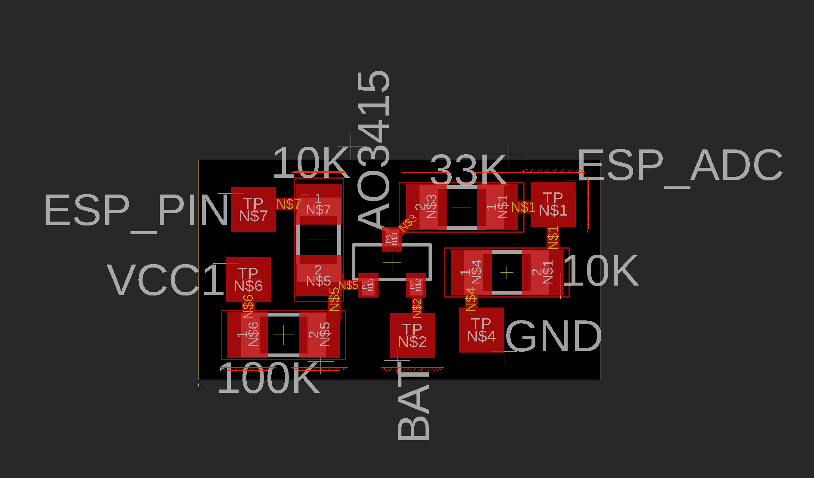

# Credit Card Sized ESP32 Powerbank

A compact powerbank with an ESP32-C3 super mini and an 8x8 RGB matrix built into it. Everything fits in a credit card-sized wallet.
You can charge it through the front USB-C port or if the switch is turned on, through the side port. 
The USB-C charging cable can be pulled out around 3cm and it outputs a maximum of 10 Watts. 
The matrix is rgb and can be programmed using the esp32.

### Features
- 3000mAh battery
- USB-C charging for your phone
- Tiny switch to enable the ESP32-C3
- 8x8 RGB matrix visible from the outside
- Voltage measure pcb with p channel mosfet
- USB-C port accessible for programming the ESP32
- Bluetooth and Wi-Fi ready

### Hardware
- ESP32-C3 super mini
- 8x8 RGB matrix
- 3000mAh Li-ion battery
- USB-C connector
- Switch for powering ESP32
- P channel mosfet
- 10K, 33K, 10K, 100K -resistor

### Software
- Arduino IDE
- Connect via USB-C on right side for programming

### Measure Voltage
The voltage measurement feature can be build really simple. Its just a P channel mosfet and a voltage divider.
The mosfets gate is connected to any esp32 pin. The source gets connected to the battery voltage and the drain is connected to a voltage divider. The middle of the voltage divider is connected to the esp32 adc pin 4. 

Why the mosfet, you would aks? Since we use a voltage divider between the battery and gnd, the battery would slowly discharge over time. To prevent this, we use the mosfet, which only enables the voltage divider if the esp32 gpio pin connected to mosfet gate is set to low. Otherwise the mosfet is just closed and nothing gets to the voltage divider.

### Building

